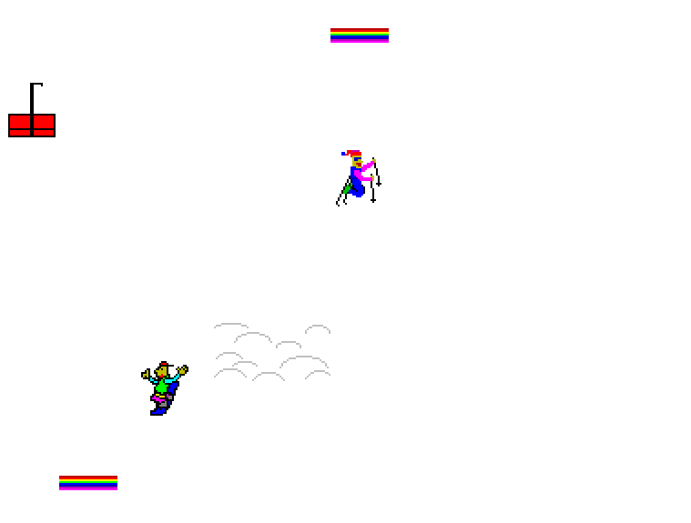

Skifree Decompilation Project
=============================
By Eric Fry

A source code reconstruction of the 32bit version of Skifree (v1.04) back to C, compilable with Visual Studio 6.



The project aims to be byte compatible with the original version. Currently, all code has been converted
back to C and labeled.

You will need the original EXE for the gfx and icon resource. You can download the original version
from the official Skifree website [https://ski.ihoc.net/](https://ski.ihoc.net/)

```
$ md5sum ski32.exe
c5515451d8f90a822457a4a8e4bf1791 *ski32.exe
```

Compiling
---------

The project was developed using Visual Studio 6 (8167) running in Windows XP.

You will need to extract the graphic and icon resources from the original executable.
These need to be placed in the `resources/` directory. The images must be named `ski32_n.bmp`
with `n` being 1 to 89. The icon should be named `iconski.ico`

Progress
----
- [x] Convert functions to C
- [ ] Convert data to C
- [ ] Make sure all functions exactly match with the original binary
- [ ] Make sure data segments match the original exactly